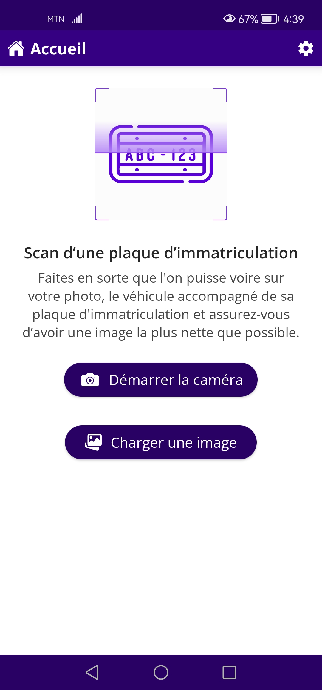
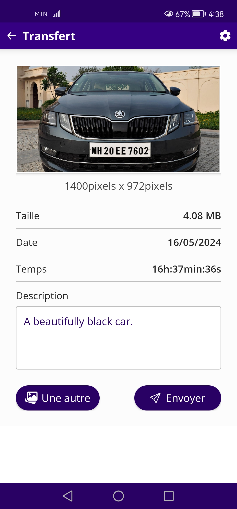

# Number Plate Scanner


Number Plate Scanner has been made to take a capture of a car with his
plate number from device native camera and send it to remote back-end
server for his identification. This mobile application has been built
to make a quick presentation of automobile number plate detection
software.

## Table of contents
1. [Access links](#links)
2. [Reference](#ref)
3. [Final result](#result)
4. [Project installation](#install)
5. [Sources code cloning](#cloning)

## Access links <a id = "links"></a>
The project distribution version can be accessible through the link below :
- https://gitlab.com/obrymec/number_plate_scanner/-/blob/master/dist/numberplate_scanner_v0.1.4b10.apk?ref_type=heads

## Reference <a id = "ref"></a>
The project can be found via the link below :
- https://github.com/obrymec/number_plate_scanner

## Final result <a id = "result"></a>
This is the final result of the project :<br/><br/>



## Project installation <a id = "install"></a>
To be able to run this project in development
mode, you will need to install <i>
<a href = "https://developer.android.com">Android Studio</a></i>.
Download it and then decompress the downloaded zip file into
a folder called <b><i>soft</i></b> inside <b><i>home</i></b>
folder like that : <b><i>/home/soft/android_studio</i></b>.
Before start installation, run the following commands :
```sh
sudo apt-get -y install libc6:i386 libncurses5:i386 libstdc++6:i386 lib32z1 libbz2-1.0:i386;\
sudo apt-get -y install qemu-kvm libvirt-daemon-system libvirt-clients bridge-utils;\
sudo adduser `id -un` libvirt;\
sudo adduser `id -un` kvm;\
virsh list --all
```
Now, you can install Android Studio. After installation, don't
forget to install <i>cmdline-tools</i> and <i>latest API levels</i>
from SDK manager before restart Android Studio. For more information,
you can visit the following links below :
- https://help.ubuntu.com/community/KVM/Installation
- https://developer.android.com/studio/install

## Sources code cloning <a id = "cloning"></a>
```sh
git clone git@gitlab.com:obrymec/number_plate_scanner.git number_plate_scanner/
```

Enjoy :)
